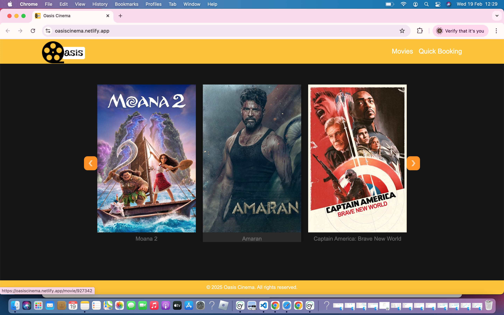
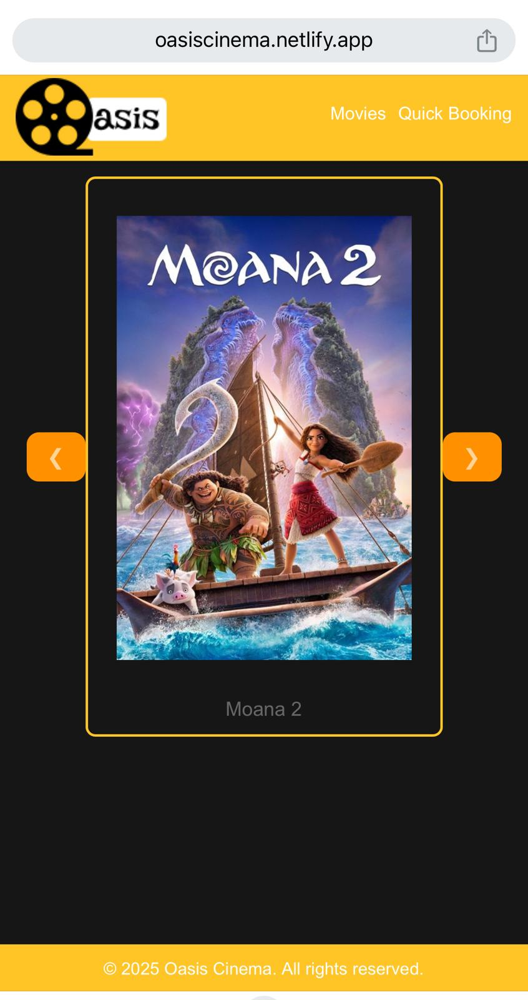
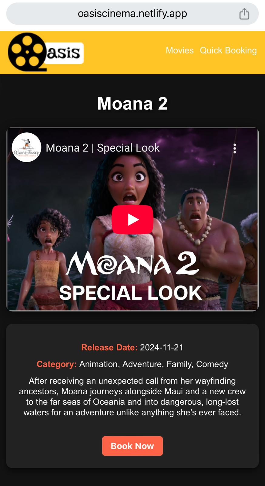

# Oasis Cinema Ticket Booking System 🎥🍿

Welcome to **Oasis Cinema**, a cinema ticket booking system built using **React.js**, **Vite**, and **localStorage** to provide a smooth and efficient booking experience for moviegoers. With this system, you can easily browse movies, view movie details, and reserve tickets in just a few simple steps.

---

## 🌟 Project Overview

Oasis Cinema is a user-friendly movie ticket booking platform that allows users to:

- Browse movies fetched from **The Movie Database (TMDB) API**
- View movie details and available showtimes
- Quickly book tickets with basic user details
- Receive a booking confirmation screen
- Enjoy a **responsive design** for a seamless experience across devices
- **Quick Booking:** Skip browsing movie posters and go straight to the booking form if you already know the movie you want.
- **Book via Movie Details:** Clicking on a movie from the **home page** redirects users to the **movie details page**, where they can view details and find a **“Book Now”** button. This button opens the booking form directly on the movie details page.
- **Explore All Movies:** A dedicated **/movies** page displays all available movies in a **grid layout**. Users can click on any movie to view details and proceed with booking via the **/moviesdetails** page.
- **Interactive Home Page:** The homepage features a **carousel design** that allows users to swipe through movies in a visually engaging way.

---

## 🔥 Current Features:

✅ **Browse Movies**: Users can browse a list of movies fetched from TMDB.  
✅ **Movie Details**: Each movie has detailed information, including available showtimes.  
✅ **Quick Booking**: Users can select the number of tickets, enter their name, email, and other details, and book tickets immediately.  
✅ **Book from Movie Details**: Users can click on a movie, view its details, and book directly from the **movie details page**.  
✅ **Dedicated Movies Page**: A **grid layout** page (/movies) lists all available movies, allowing users to explore and book with ease.  
✅ **Booking Confirmation**: A confirmation page displays the selected movie, showtime, number of tickets, and user details.  
✅ **Responsive Design**: The application is fully responsive, making it mobile-friendly and accessible on various screen sizes.  
✅ **Home Page Carousel**: A beautifully designed **carousel** on the homepage provides a smooth way to browse featured movies.  
✅ **Built with Vite**: Uses **Vite** for faster development and optimized builds.  
✅ **End-to-End Testing**: **Cypress** is used for testing to ensure a smooth user experience.  

---

## 💡 Future Features (Nice-to-Have):

While the core features are implemented and functional, here are some additional features planned for future updates:

🚀 **MongoDB Integration**: Store booking details persistently using **MongoDB** for more advanced data handling.  
🔒 **User Authentication**: Implement a login/signup system for users to save their bookings and view a **“My Bookings”** section.  
⭐ **Favorite Movies**: Allow users to mark movies as favorites and view them later.  
🎟 **Seat Selection**: Enable users to choose specific seats when booking tickets for better customization.  

---

## 🛠 Technologies Used:

- **React.js** – Frontend library for building the user interface.
- **Vite** – Fast and optimized development environment.
- **TMDB API** – API to fetch movie data (posters, details, showtimes).
- **localStorage** – To persist user selections and bookings between page refreshes.
- **Cypress** – End-to-end testing framework.
- **CSS** – Custom styles to ensure the site is visually appealing and responsive.

---

## 💡 How It Works:

1. **Browse Movies**: The homepage fetches movies from **TMDB API**, allowing users to explore available titles.
2. **View Movie Details**: Clicking on a movie displays detailed information, including showtimes, and provides a **“Book Now”** button.
3. **Quick Booking**: Users can select ticket quantity, provide their name and email, specify a booking date, and confirm the booking.
4. **Explore All Movies**: The **/movies** page lists all available movies in a **grid format**, allowing users to click on any title for details and booking.
5. **Booking Confirmation**: A confirmation page displays selected details, ensuring a smooth experience.

---

## 📸 Screenshots:

### 🖥 Desktop View  
  

### 📱 Mobile View  
**Responsive Carousel on Home Page**  
  
  

A quick look at the app in action:

- Browse movies easily with a **responsive carousel**.
- View movie details and available showtimes.
- Seamless booking experience with **quick booking option**.
- Explore all available movies in a **grid layout**.
- Book directly from the **movie details page**.

---

## 🌍 Live Demo

Experience Oasis Cinema live! Click the link below to explore the website:

🔗 [Oasis Cinema](https://oasiscinema.netlify.app/)

🚀 **Enjoy booking your favorite movies with Oasis Cinema!** 🎬🍿
